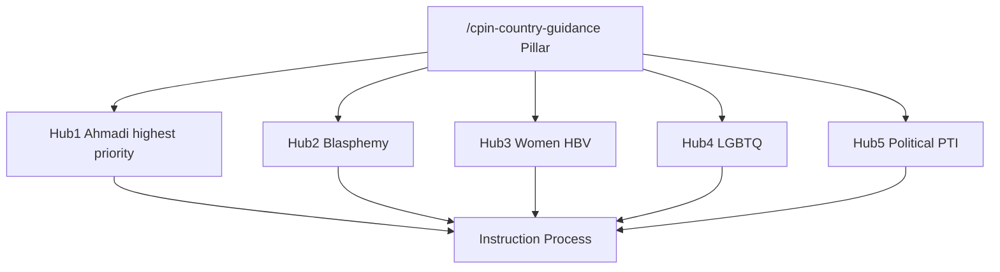
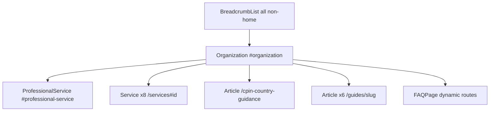

# SEO Architecture: pakistanexpertreports.com

**Canonical domain:** `https://www.pakistanexpertreports.com`  
**Site name:** Pakistan Expert Reports  
**Locale:** `en_GB` (UK immigration solicitors, law firms, Legal Aid practitioners)

This document is the single source of truth for keyword strategy, content clusters, two-domain redirect strategy, internal linking, GEO (Generative Engine Optimization), off-page SEO, schema architecture, and launch deployment for pakistanexpertreports.com. All slugs and URLs align with the canonical build-spec naming convention.

**Implementation status:** This document reflects the **target** architecture (June 2026). Pakistan slugs, metadata, internal linking matrix, CPIN anchors, glossary anchors, and sitemap are implemented in code. Domain flip (`pakistancountryexpert.com` → redirect; `pakistanexpertreports.com` → primary) and rebranding are documented in Section 6 and Appendix E. Run `npm run seo:generate && npm run seo:verify` after content or route changes. Removed pages (`/fees`, `/faq`, `/experts`) redirect to `/how-to-instruct`, `/guides`, and `/qualifications` respectively.

---

## 1. Keyword Strategy

### Tier 1 — Transactional

**Target pages:** homepage, services, asylum profiles, qualifications, case types, contact.

| Keyword | Primary URL |
|---------|-------------|
| Pakistan expert reports UK | `/`, `/what-is-a-pakistan-expert-report` |
| Pakistan country expert report UK | `/`, `/services/country-condition-reports` |
| Pakistan asylum expert report UK | `/services`, `/how-to-instruct` |
| Pakistan expert report immigration tribunal | `/qualifications`, `/case-types/asylum-appeal-ftt` |
| Pakistan Ahmadi expert report UK | `/asylum-profiles/ahmadi-muslims-pakistan`, `/services/ahmadi-asylum-reports` |
| Pakistan blasphemy expert report UK | `/asylum-profiles/blasphemy-accusations-pakistan`, `/services/blasphemy-expert-reports` |
| Pakistan expert witness report asylum | `/`, `/asylum-profiles` |
| Pakistan country report solicitor UK | `/guides/instructing-pakistan-expert`, `/contact` |
| Pakistan Ahmadi asylum expert report UK | `/asylum-profiles/ahmadi-muslims-pakistan`, `/guides/ahmadi-asylum-pakistan-guide` |
| Legal Aid Pakistan expert report UK | `/how-to-instruct`, `/guides/instructing-pakistan-expert` |

### Tier 2 — Informational

**Target pages:** CPIN pillar, guides, asylum profiles, glossary.

| Keyword | Primary URL |
|---------|-------------|
| Pakistan CPIN Ahmadis 2025 expert report | `/cpin-country-guidance#ahmadis`, `/guides/pakistan-cpin-guide` |
| Pakistan blasphemy asylum expert report UK | `/asylum-profiles/blasphemy-accusations-pakistan`, `/guides/blasphemy-pakistan-expert-guide` |
| Ahmadi asylum expert report evidence UK | `/asylum-profiles/ahmadi-muslims-pakistan`, `/guides/ahmadi-asylum-pakistan-guide` |
| Pakistan honour based violence expert report | `/asylum-profiles/women-honour-based-violence`, `/guides/honour-based-violence-pakistan` |
| Pakistan LGBTQ asylum expert report UK | `/asylum-profiles/lgbtq-asylum-pakistan`, `/glossary#s377-pakistan-penal-code` |
| MN and Others Pakistan 2012 expert evidence | `/cpin-country-guidance#mn-and-others-2012`, `/glossary#country-guidance-mn-and-others-2012` |
| Pakistan country guidance expert report | `/cpin-country-guidance`, `/glossary#country-guidance-mn-and-others-2012` |
| Pakistan internal relocation women expert report | `/asylum-profiles/women-honour-based-violence`, `/cpin-country-guidance#internal-relocation` |
| Pakistan PTI asylum expert report UK 2025 | `/asylum-profiles/political-persecution-pakistan`, `/guides/pakistan-political-asylum-guide` |
| Pakistan TLP blasphemy expert report asylum | `/asylum-profiles/ahmadi-muslims-pakistan`, `/glossary#tlp-tehreek-e-labbaik-pakistan` |

### Tier 3 — Long-tail

**Target pages:** asylum profiles, guides, case types, qualifications, how-to-instruct.

| Keyword | Primary URL(s) |
|---------|----------------|
| Ahmadi asylum expert report UK tribunal | `/asylum-profiles/ahmadi-muslims-pakistan`, `/case-types/ahmadi-asylum-claims` |
| Pakistan blasphemy acquittal still at risk expert report | `/asylum-profiles/blasphemy-accusations-pakistan`, `/case-types/blasphemy-asylum-pakistan`, `/guides/blasphemy-pakistan-expert-guide` |
| Pakistan women honour killing expert report UK | `/asylum-profiles/women-honour-based-violence`, `/case-types/honour-based-violence-pakistan` |
| Pakistan Shia Muslim asylum expert report UK | `/asylum-profiles/shia-muslims-pakistan`, `/case-types/asylum-appeal-ftt` |
| Pakistan Christian blasphemy expert report UK | `/asylum-profiles/christians-religious-minorities`, `/asylum-profiles/blasphemy-accusations-pakistan` |
| Pakistan PTI supporter asylum expert report UK 2025 | `/asylum-profiles/political-persecution-pakistan`, `/case-types/political-claim-pakistan`, `/guides/pakistan-political-asylum-guide` |
| Pakistan expert report Legal Aid rates | `/how-to-instruct`, `/guides/instructing-pakistan-expert` |
| Pakistan Jaranwala Christians expert report UK | `/asylum-profiles/christians-religious-minorities`, `/guides/blasphemy-pakistan-expert-guide` |
| Ahmadiyya verification expert report asylum UK | `/guides/ahmadi-asylum-pakistan-guide`, `/glossary#ahmadiyya-muslim-association-uk` |
| Pakistan expert report CPIN challenge UK solicitor | `/cpin-country-guidance`, `/guides/pakistan-cpin-guide`, `/services/cpin-challenge` |

### Keyword → URL implementation reference

| Cluster | URL pattern | Meta source |
|---------|-------------|-------------|
| Brand / transactional | `/` | Page-level `createMetadata()` |
| Asylum profile transactional | `/asylum-profiles/{slug}` | `metaTitle`, `metaDescription`, `h1` in `data/asylum-profiles.ts` |
| CPIN pillar / informational | `/cpin-country-guidance` | Page-level metadata + section anchors |
| Case-type transactional | `/case-types/{slug}` | `data/case-types.ts` |
| Informational guides | `/guides/{slug}` | `data/guides.ts` |
| Utility / process | `/how-to-instruct`, `/qualifications` | Page-level metadata |
| Services | `/services`, `/services/{id}` | `data/services.ts` |

**Route note:** `/what-is-a-pakistan-expert-report` is the canonical GEO target #8 URL. Legacy `/what-is-a-pakistan-expert-witness` 301-redirects to it (see Appendix E).

### Cluster shorthand → canonical slug redirects

SEO cluster briefs use shorter paths. Canonical URLs use build-spec slugs. 301 redirects in `lib/seo/slug-redirects.ts`:

| Shorthand path | Canonical path |
|----------------|----------------|
| `/asylum-profiles/ahmadi-muslims` | `/asylum-profiles/ahmadi-muslims-pakistan` |
| `/asylum-profiles/blasphemy` | `/asylum-profiles/blasphemy-accusations-pakistan` |
| `/asylum-profiles/women-hbv` | `/asylum-profiles/women-honour-based-violence` |
| `/asylum-profiles/lgbtq-pakistan` | `/asylum-profiles/lgbtq-asylum-pakistan` |
| `/asylum-profiles/political-persecution` | `/asylum-profiles/political-persecution-pakistan` |
| `/guides/ahmadi-asylum-pakistan` | `/guides/ahmadi-asylum-pakistan-guide` |
| `/guides/blasphemy-pakistan-guide` | `/guides/blasphemy-pakistan-expert-guide` |
| `/guides/honour-based-violence` | `/guides/honour-based-violence-pakistan` |
| `/guides/pakistan-political-asylum` | `/guides/pakistan-political-asylum-guide` |
| `/case-types/blasphemy-asylum` | `/case-types/blasphemy-asylum-pakistan` |
| `/case-types/hbv-pakistan` | `/case-types/honour-based-violence-pakistan` |
| `/case-types/political-claim` | `/case-types/political-claim-pakistan` |

---

## 2. Content Clusters

Six topical hubs drive internal linking, anchor text, and content depth. Hub 6 (CPIN Master) connects all profile and case-type spokes. Hub 1 (Ahmadi Muslims) is highest priority.



### Hub 1: Ahmadi Muslims (highest priority)

| Role | URL |
|------|-----|
| Profile | `/asylum-profiles/ahmadi-muslims-pakistan` |
| Guide | `/guides/ahmadi-asylum-pakistan-guide` |
| Case type | `/case-types/ahmadi-asylum-claims` |
| Glossary | `/glossary#ahmadi-qadiani`, `/glossary#ordinance-xx-1984-ahmadis`, `/glossary#tlp-tehreek-e-labbaik-pakistan` |
| CPIN section | `/cpin-country-guidance#ahmadis` |

### Hub 2: Blasphemy

| Role | URL |
|------|-----|
| Profile | `/asylum-profiles/blasphemy-accusations-pakistan` |
| Guide | `/guides/blasphemy-pakistan-expert-guide` |
| Case type | `/case-types/blasphemy-asylum-pakistan` |
| Glossary | `/glossary#blasphemy-laws-ss295-298-ppc` |
| CPIN section | `/cpin-country-guidance#blasphemy` |

### Hub 3: Women / Honour-Based Violence

| Role | URL |
|------|-----|
| Profile | `/asylum-profiles/women-honour-based-violence` |
| Guide | `/guides/honour-based-violence-pakistan` |
| Case type | `/case-types/honour-based-violence-pakistan` |
| Glossary | `/glossary#honour-killing`, `/glossary#honour-based-violence` |
| CPIN section | `/cpin-country-guidance#women-vawg` |

### Hub 4: LGBTQ+

| Role | URL |
|------|-----|
| Profile | `/asylum-profiles/lgbtq-asylum-pakistan` |
| Case type | `/case-types/asylum-appeal-ftt` (no dedicated LGBTQ case-type page; use FTT appeal) |
| Glossary | `/glossary#s377-pakistan-penal-code`, `/glossary#khawaja-sira` |
| CPIN section | `/cpin-country-guidance#lgbtq` |

### Hub 5: Political / PTI

| Role | URL |
|------|-----|
| Profile | `/asylum-profiles/political-persecution-pakistan` |
| Guide | `/guides/pakistan-political-asylum-guide` |
| Case type | `/case-types/political-claim-pakistan` |
| Glossary | `/glossary#pti-pakistan-tehreek-e-insaf`, `/glossary#enforced-disappearances` |
| CPIN section | `/cpin-country-guidance#political-opposition` |

### Hub 6: CPIN Master

| Role | URL |
|------|-----|
| Pillar | `/cpin-country-guidance` |
| All profiles | `/asylum-profiles/[slug]` (8 pages) |
| All case types | `/case-types/[slug]` (8 pages) |
| CPIN guide | `/guides/pakistan-cpin-guide` |

Hub 6 also connects secondary profiles not covered by Hubs 1 to 5:

- `/asylum-profiles/shia-muslims-pakistan`
- `/asylum-profiles/christians-religious-minorities`
- `/asylum-profiles/actors-of-protection-pakistan`

### Instruction process (cross-hub)

| Role | URL |
|------|-----|
| Process | `/how-to-instruct` |
| Credentials | `/qualifications` |
| Legal Aid / fees | `/how-to-instruct` (no dedicated `/fees` page; `/fees` redirects here) |
| Solicitor guide | `/guides/instructing-pakistan-expert` |

### Slug inventory

**Asylum profiles (8):**

`ahmadi-muslims-pakistan`, `blasphemy-accusations-pakistan`, `shia-muslims-pakistan`, `women-honour-based-violence`, `lgbtq-asylum-pakistan`, `political-persecution-pakistan`, `christians-religious-minorities`, `actors-of-protection-pakistan`

**Case types (8):**

`asylum-appeal-ftt`, `upper-tribunal-pakistan`, `ahmadi-asylum-claims`, `blasphemy-asylum-pakistan`, `honour-based-violence-pakistan`, `deportation-removal-pakistan`, `fresh-claims-pakistan`, `political-claim-pakistan`

**Guides (6):**

`ahmadi-asylum-pakistan-guide`, `blasphemy-pakistan-expert-guide`, `pakistan-cpin-guide`, `honour-based-violence-pakistan`, `pakistan-political-asylum-guide`, `instructing-pakistan-expert`

**Services (8 IDs):**

`country-condition-reports`, `ahmadi-asylum-reports`, `blasphemy-expert-reports`, `honour-based-violence-reports`, `lgbtq-asylum-pakistan`, `political-persecution-reports`, `cpin-challenge`, `oral-evidence`

### Glossary anchor ID convention

Generate fragment IDs from term text:

```js
term.toLowerCase().replace(/[^a-z0-9]+/g, "-").replace(/^-|-$/g, "")
```

**SEO-critical anchor mappings** (cluster brief shorthand → canonical anchor):

| Cluster reference | Glossary term | Canonical anchor ID |
|-------------------|---------------|---------------------|
| `#ahmadi` | Ahmadi (Qadiani) | `ahmadi-qadiani` |
| `#ordinance-xx` | Ordinance XX 1984 (Ahmadis) | `ordinance-xx-1984-ahmadis` |
| `#tlp` | TLP (Tehreek-e-Labbaik Pakistan) | `tlp-tehreek-e-labbaik-pakistan` |
| `#blasphemy-laws` | Blasphemy Laws (ss295-298 PPC) | `blasphemy-laws-ss295-298-ppc` |
| `#honour-killing` | Honour Killing | `honour-killing` |
| `#s377` | s377 Pakistan Penal Code | `s377-pakistan-penal-code` |
| `#cpin` | CPIN (Country Policy Information Note) | `cpin-country-policy-information-note` |
| `#mn-and-others-2012` | Country Guidance (MN and Others [2012]) | `country-guidance-mn-and-others-2012` |
| `#state-protection` | State Protection | `state-protection` |
| `#internal-relocation` | Internal Relocation Alternative | `internal-relocation-alternative` |
| `#pti` | PTI (Pakistan Tehreek-e-Insaf) | `pti-pakistan-tehreek-e-insaf` |
| `#ahmadiyya-verification` | Ahmadiyya Muslim Association UK | `ahmadiyya-muslim-association-uk` |

### Internal linking rules

#### Rule A: Every `/asylum-profiles/[slug]` must link to:

- `/cpin-country-guidance` (relevant CPIN section anchor)
- Relevant `/case-types/[slug]` page(s)
- Relevant `/guides/[slug]` page(s)
- `/how-to-instruct`
- `/contact`

#### Rule B: Every `/guides/[slug]` must link to:

- Relevant `/asylum-profiles/[slug]` page(s)
- `/cpin-country-guidance`
- `/how-to-instruct`
- `/contact`

#### Every `/case-types/[slug]` must link to:

- Relevant `/asylum-profiles/[slug]` page(s)
- `/how-to-instruct`
- `/contact`

#### `/cpin-country-guidance` must link to:

- All 8 `/asylum-profiles/[slug]` pages
- All 6 `/guides/[slug]` pages
- `/how-to-instruct`
- `/contact`

#### Homepage must link to:

- Top 4 transactional profiles: Ahmadi, Blasphemy, Women/HBV, Political/PTI
- `/cpin-country-guidance`
- `/asylum-profiles` hub
- `/guides` hub
- `/how-to-instruct`
- `/contact`

#### Glossary terms must link to:

- Most relevant `/asylum-profiles/[slug]`
- Most relevant `/guides/[slug]`
- `/cpin-country-guidance` where applicable

**Enforcement:** populate `relatedLinks` in `data/related-links.ts` from [Appendix D](#appendix-d-profile-minimum-links-matrix). Use descriptive anchor text (e.g. "March 2025 CPIN on Ahmadis" not "click here").

**Cross-linking priority:** Hub pillar → profile/guide → instruction → contact.

---

## 3. Two-Domain Strategy

`pakistancountryexpert.com` 301 redirects to `pakistanexpertreports.com`. This passes link equity from the "country expert" keyword variant and captures both search intents without content duplication. Canonical URLs always point to `pakistanexpertreports.com`.

| Domain | Role |
|--------|------|
| `www.pakistanexpertreports.com` | **Canonical host** (all content lives here) |
| `pakistanexpertreports.com` (apex) | **301 →** `https://www.pakistanexpertreports.com` |
| `pakistancountryexpert.com` | **Redirect domain** (301 to primary) |
| `www.pakistancountryexpert.com` | **Redirect domain** (301 to primary) |

**Rationale:** Solicitors search for both "Pakistan expert reports" and "Pakistan country expert report". A single site on the primary domain with 301 redirects from the secondary domain passes link equity and avoids duplicate content penalties.

**Implementation targets:**

1. **Vercel:** Add both domains to the same project.
2. **`middleware.ts`:** Host checks for:
   - `pakistanexpertreports.com` (apex) → `https://www.pakistanexpertreports.com` (301)
   - `pakistancountryexpert.com` → `https://www.pakistanexpertreports.com` (301)
   - `www.pakistancountryexpert.com` → `https://www.pakistanexpertreports.com` (301)
3. **Canonicals:** All `createMetadata()` canonical URLs, sitemap entries, and schema `@id` values use `https://www.pakistanexpertreports.com` only.
4. **No separate site** on `pakistancountryexpert.com`.

**Target middleware pattern:**

```ts
const PRIMARY_HOST = "www.pakistanexpertreports.com";
const PRIMARY_ORIGIN = "https://www.pakistanexpertreports.com";
const REDIRECT_HOSTS = new Set([
  "pakistanexpertreports.com",
  "pakistancountryexpert.com",
  "www.pakistancountryexpert.com",
]);
```

**Code migration required:** Current `middleware.ts` and `lib/constants.ts` still treat `pakistancountryexpert.com` as primary. See Section 6 and Appendix E.

---

## 4. GEO Optimization Targets

Content structured for AI citation and featured snippets: definition-first, tables, numbered steps, citeable statistics.

| # | GEO target | URL | Required extractable artifact |
|---|------------|-----|------------------------------|
| 1 | Pakistan CPIN quick reference table | `/cpin-country-guidance` | Topic, version/date, key finding table |
| 2 | Ahmadi legal position explained (expert report context) | `/asylum-profiles/ahmadi-muslims-pakistan` | Ordinance XX, TLP, blasphemy charges summary |
| 3 | Blasphemy law misuse analysis for tribunal reports | `/asylum-profiles/blasphemy-accusations-pakistan` | ss295-298 PPC, mob justice, acquittal risk |
| 4 | MN and Others [2012] summary for solicitors commissioning reports | `/cpin-country-guidance#mn-and-others-2012` | UKUT 00389 summary block |
| 5 | March 2025 CPIN key findings | `/cpin-country-guidance#ahmadis` | Version 6.0: state able but unwilling |
| 6 | TLP threat to Ahmadis — expert report evidence | `/asylum-profiles/ahmadi-muslims-pakistan` | Mob violence, blasphemy mobilisation list |
| 7 | Ahmadiyya UK verification process for expert report instruction | `/guides/ahmadi-asylum-pakistan-guide` | Numbered verification steps |
| 8 | What a Pakistan expert report should contain (featured snippet target) | `/what-is-a-pakistan-expert-witness` (interim) | Definition-first paragraph + checklist |

**GEO content rules:**

- Lead with a direct answer paragraph (40 to 60 words) before depth.
- Tables use `<table>` with `<caption>` and header row for accessibility and parsing.
- Include source citations (OSCOLA-style) where statistics or CPIN positions are cited.
- Avoid gating key factual content behind accordions only.

**CPIN quick reference table (GEO #1), required rows:**

| CPIN Topic | Version/Date | Key Finding |
|-----------|-------------|-------------|
| Ahmadis | Version 6.0, March 2025 | State able but unwilling; killing of Ahmadis on rise; police complicit |
| Shia Muslims | July 2021 | Sectarian risk; protection limited |
| Healthcare/Medical | July 2024 | Variable access |
| Country of Origin Background | Current | General overview |

---

## 5. Off-Page SEO Targets

### Directories (listing submissions)

| Directory | URL | Target page to link |
|-----------|-----|---------------------|
| Electronic Immigration Network (EIN) | [ein.org.uk/experts](https://ein.org.uk/experts) | `/`, `/asylum-profiles/*` — list as **Pakistan Expert Reports** under "expert reports" category |
| ILPA membership directory | ILPA member directory | `/qualifications`, `/guides/*` |
| Free Movement | [freemovement.org.uk](https://freemovement.org.uk) | `/cpin-country-guidance`, `/guides/*` |
| Ahmadiyya Muslim Association UK | Potential linking partner | `/asylum-profiles/ahmadi-muslims-pakistan`, `/guides/ahmadi-asylum-pakistan-guide` |
| BPAS / Pakistan human rights organisations | Outreach targets | `/asylum-profiles/*`, `/cpin-country-guidance` |
| UK immigration tribunal practitioner forums | Community outreach | `/qualifications`, `/case-types/*` |

**Submission tracking template:**

| Directory | Owner | Submitted | Live URL | Referral sessions/mo |
|-----------|-------|-----------|----------|----------------------|
| EIN | | | | |
| ILPA | | | | |
| Free Movement | | | | |
| Ahmadiyya Muslim Association UK | | | | |
| BPAS / human rights orgs | | | | |
| Tribunal practitioner forums | | | | |

### Publications (citations / guest content)

| Publication | Focus |
|-------------|-------|
| Free Movement | freemovement.org.uk: asylum, country guidance, CPIN challenges |
| ILPA | Immigration practitioners, tribunal practice |
| Legal Action Group (LAG) | Legal aid, tribunal practice |
| UK Human Rights Blog | Human rights, country conditions |

**Outreach KPI template:**

| Publication | Piece title | Published | Backlink URL | Domain rating |
|-------------|-------------|-----------|--------------|---------------|
| | | | | |

### Digital PR angles

1. **Pakistan CPIN Ahmadis March 2025: What UK Asylum Solicitors Need to Know** (supports `/cpin-country-guidance` and GEO #1, #5)
2. **TLP Blasphemy Mob Violence and Ahmadi Asylum Claims in the UK** (Hub 1, `/asylum-profiles/ahmadi-muslims-pakistan`)
3. **Blasphemy Acquittal Does Not Mean Safety: Expert Evidence in Pakistan Asylum Cases** (Hub 2, `/asylum-profiles/blasphemy-accusations-pakistan`)
4. **MN and Others [2012] and the March 2025 Ahmadi CPIN: Still Relevant for UK Tribunals** (`/cpin-country-guidance#mn-and-others-2012`)
5. **PTI Supporters and Political Persecution: Pakistan Asylum Evidence in 2025** (Hub 5, `/asylum-profiles/political-persecution-pakistan`)
6. **Legal Aid Instruction of Pakistan Expert Reports: A Solicitor's Checklist** (`/guides/instructing-pakistan-expert`)

---

## 6. Deployment Checklist

| Task | Implementation | Status |
|------|----------------|--------|
| Netlify / production deployment | Connect repo; production branch deploy | Pending (manual) |
| DNS: `pakistanexpertreports.com` → www | Registrar CNAME + `middleware.ts` apex 301 | Pending (manual) |
| 301 redirect: `pakistancountryexpert.com` → `https://www.pakistanexpertreports.com` | `middleware.ts` + Netlify domain config | **Implemented** in `middleware.ts` |
| `NEXT_PUBLIC_SITE_URL` / `SITE_URL` | `https://www.pakistanexpertreports.com` in `lib/constants.ts` | **Implemented** |
| Contact form → Google Sheets + webhook | `/api/submit-lead` + `lib/google-sheets.ts` | **Implemented** |
| `GOOGLE_SITE_VERIFICATION` | `metadata.verification.google` in `app/layout.tsx` | Pending (env var) |
| `BING_SITE_VERIFICATION` | `metadata.other` in layout | Pending (env var) |
| `NEXT_PUBLIC_GA_MEASUREMENT_ID` | Analytics component (consent-gated) | Pending (env var) |
| `html lang="en-GB"` | Root layout `<html lang="en-GB">` | Implemented |
| `hreflang` | `en-GB`, `en-US`, `x-default` in `alternates.languages` | Implemented |
| Submit sitemap | GSC + Bing Webmaster: `/sitemap.xml` | Pending (post-deploy) |
| Google Search Console | Both domains — redirect domain monitored for coverage | Pending (post-deploy) |
| LinkedIn company page | `PakistanExpertReports` → `sameAs` in Organization schema | **Implemented** |
| EIN directory submission | ein.org.uk/experts — "expert reports" category | Manual post-launch |
| ILPA submission | ILPA membership directory | Manual post-launch |

**Canonical and robots:**

- All pages: canonical via `createMetadata()` in `lib/metadata.ts`
- Staging/preview: `noindex: true` on non-production hosts
- Production: `app/robots.ts` allow `/`, point to sitemap
- Exclude from sitemap: `/contact`, `/thank-you`, `/privacy`, `/terms`, `/cookie-policy`

**Reference implementation:** `nigeria-expert/app/layout.tsx`, `nigeria-expert/lib/metadata.ts`, `nigeria-expert/middleware.ts`

---

## Appendix A: Full URL Inventory (~40 routes)

### Static and hub pages (10 indexable)

| URL | Sitemap priority |
|-----|------------------|
| `/` | 1.0 |
| `/cpin-country-guidance` | 0.95 |
| `/asylum-profiles` | 0.93 |
| `/services` | 0.90 |
| `/what-is-a-pakistan-expert-report` | 0.90 |
| `/case-types` | 0.88 |
| `/how-to-instruct` | 0.88 |
| `/qualifications` | 0.88 |
| `/guides` | 0.87 |
| `/glossary` | 0.75 |

### Redirect-only paths (not indexable pages)

| URL | Redirects to |
|-----|--------------|
| `/fees` | `/how-to-instruct` |
| `/faq` | `/guides` |
| `/experts` | `/qualifications` |

### Dynamic pages (30)

| Pattern | Count | Sitemap priority |
|---------|-------|------------------|
| `/asylum-profiles/{slug}` | 8 | 0.92 (0.94 for Ahmadi, blasphemy) |
| `/case-types/{slug}` | 8 | 0.88 |
| `/guides/{slug}` | 6 | 0.82 |
| `/services/{id}` | 8 | 0.90 |

### Legal / utility (noindex or excluded)

| URL | Robots |
|-----|--------|
| `/contact` | Excluded from sitemap |
| `/privacy` | noindex, follow |
| `/terms` | noindex, follow |
| `/cookie-policy` | noindex, follow |
| `/thank-you` | noindex, nofollow |

**Total indexable URLs:** ~40 (excluding `/contact`, `/thank-you`, `/privacy`, `/terms`, `/cookie-policy`).

---

## Appendix B: Sitemap Priorities

| Route family | Priority |
|--------------|----------|
| `/` | 1.0 |
| `/cpin-country-guidance` | 0.95 |
| `/asylum-profiles` (hub) | 0.93 |
| `/asylum-profiles/ahmadi-muslims-pakistan` | 0.94 |
| `/asylum-profiles/blasphemy-accusations-pakistan` | 0.94 |
| `/asylum-profiles/[other slug]` | 0.92 |
| `/services`, `/what-is-a-pakistan-expert-witness` | 0.90 |
| `/services/{id}` | 0.90 |
| `/case-types` (hub), `/case-types/[slug]` | 0.88 |
| `/how-to-instruct`, `/qualifications` | 0.88 |
| `/guides` (hub) | 0.87 |
| `/guides/[slug]` | 0.82 |
| `/glossary` | 0.75 |

**Priority boost for highest-volume profiles:**

- `/asylum-profiles/ahmadi-muslims-pakistan`: top transactional spoke (Hub 1)
- `/asylum-profiles/blasphemy-accusations-pakistan`: second priority (Hub 2)

---

## Appendix C: Schema Architecture Summary

### Root entity

```json
{
  "@type": "Organization",
  "@id": "https://www.pakistanexpertreports.com/#organization"
}
```

### Schema graph overview



### Children of Organization

| Type | Count | URL / @id | Notes |
|------|-------|-----------|-------|
| ProfessionalService | 1 | `/` (`#professional-service`) | Homepage |
| Service | 8 | `/services#{id}` | See services inventory in Section 2 |
| Article | 1 | `/cpin-country-guidance` | CPIN pillar |
| Article | 6 | `/guides/{slug}` | Guide pages |
| FAQPage | 24+ | All dynamic routes with FAQs | 2 FAQs minimum per profile/case type |
| BreadcrumbList | All non-home | Per-page | |
| WebSite | 1 | `/` | SearchAction optional |

### Page → schema template matrix

| Route | JSON-LD types |
|-------|---------------|
| `/` | Organization, ProfessionalService, WebSite |
| `/services` | Organization, Service ×8 |
| `/cpin-country-guidance` | Organization, Article, BreadcrumbList, FAQPage |
| `/guides/[slug]` | Organization, Article, BreadcrumbList |
| `/asylum-profiles/[slug]` | Organization, BreadcrumbList, FAQPage |
| `/case-types/[slug]` | Organization, BreadcrumbList, FAQPage |
| `/glossary` | Organization, BreadcrumbList |
| Static utility pages | Organization, BreadcrumbList |

**LinkedIn `sameAs`:** `https://www.linkedin.com/company/PakistanExpertReports`

---

## Appendix D: Profile Minimum Links Matrix

Minimum internal links per Section 2 Rule A. Implement via `relatedLinks` in `data/related-links.ts`.

| Profile slug | CPIN anchor | Case types | Guides |
|--------------|-------------|------------|--------|
| `ahmadi-muslims-pakistan` | `#ahmadis` | `ahmadi-asylum-claims`, `asylum-appeal-ftt` | `ahmadi-asylum-pakistan-guide` |
| `blasphemy-accusations-pakistan` | `#blasphemy` | `blasphemy-asylum-pakistan`, `asylum-appeal-ftt` | `blasphemy-pakistan-expert-guide` |
| `shia-muslims-pakistan` | `#shia-muslims` | `asylum-appeal-ftt`, `upper-tribunal-pakistan` | `pakistan-cpin-guide` |
| `women-honour-based-violence` | `#women-vawg` | `honour-based-violence-pakistan`, `asylum-appeal-ftt` | `honour-based-violence-pakistan` |
| `lgbtq-asylum-pakistan` | `#lgbtq` | `asylum-appeal-ftt`, `fresh-claims-pakistan` | `pakistan-cpin-guide` |
| `political-persecution-pakistan` | `#political-opposition` | `political-claim-pakistan`, `asylum-appeal-ftt` | `pakistan-political-asylum-guide` |
| `christians-religious-minorities` | `#blasphemy` | `blasphemy-asylum-pakistan`, `asylum-appeal-ftt` | `blasphemy-pakistan-expert-guide` |
| `actors-of-protection-pakistan` | `#actors-of-protection` | `asylum-appeal-ftt`, `upper-tribunal-pakistan` | `pakistan-cpin-guide` |

**All asylum profile pages:** `/how-to-instruct`, `/contact`

### Guide → profile links (Rule B)

| Guide slug | Required profile links |
|------------|------------------------|
| `pakistan-cpin-guide` | All 8 profiles (or top 4 + link to hub) |
| `ahmadi-asylum-pakistan-guide` | `ahmadi-muslims-pakistan` |
| `blasphemy-pakistan-expert-guide` | `blasphemy-accusations-pakistan`, `christians-religious-minorities` |
| `honour-based-violence-pakistan` | `women-honour-based-violence` |
| `pakistan-political-asylum-guide` | `political-persecution-pakistan` |
| `instructing-pakistan-expert` | Top 4 transactional profiles: Ahmadi, Blasphemy, Women/HBV, Political |

---

## Appendix E: Recommended Build Order

1. **Domain flip:** Update `lib/constants.ts` (`SITE_URL`, `SITE_NAME`, `SITE_EMAIL`, `LINKEDIN_URL`), `middleware.ts` (`PRIMARY_HOST`, `REDIRECT_HOSTS`), `lib/seo/architecture-verify.ts`
2. **Rebrand:** Sitewide copy from "country expert witness" → "expert reports"; Organization schema `sameAs` → `PakistanExpertReports`
3. Root layout (`lang="en-GB"`, hreflang), `createMetadata()`, `JsonLd`, Header/Footer (already implemented; verify domain)
4. Data layer: `asylum-profiles.ts`, `case-types.ts`, `guides.ts`, `glossary.ts`, `services.ts` (Pakistan content — implemented)
5. Dynamic routes: `/asylum-profiles/[slug]`, `/case-types/[slug]`, `/guides/[slug]` (implemented)
6. Static pages: `/cpin-country-guidance`, `/what-is-a-pakistan-expert-witness`, `/services`, `/how-to-instruct`, `/qualifications`, `/glossary`, `/contact` (implemented)
7. Rename `/what-is-a-pakistan-expert-witness` → `/what-is-a-pakistan-expert-report` with 301 redirect (GEO #8, featured snippet target)
8. Homepage with top 4 profile links (Ahmadi first), CPIN pillar link, guides hub (implemented)
9. `RelatedLinks` component + Appendix D matrix in `data/related-links.ts` (implemented)
10. GEO tables on `/cpin-country-guidance` and profile pages (Section 4)
11. `app/sitemap.ts`, `app/robots.ts`, env verification tags
12. Shorthand slug 301 redirects in `lib/seo/slug-redirects.ts` (implemented)
13. Vercel: both domains; DNS apex → www for `pakistanexpertreports.com`
14. Post-launch: EIN and ILPA directory submissions, GSC/Bing sitemap submit for both domains

---

## Document control

| Version | Date | Notes |
|---------|------|-------|
| 1.0 | 2026-06-09 | Initial SEO architecture for pakistancountryexpert.com (superseded) |
| 2.0 | 2026-06-09 | Domain inversion: pakistanexpertreports.com primary; expert reports keyword strategy |

**Related files:** `lib/metadata.ts`, `lib/schema.ts`, `lib/constants.ts`, `middleware.ts`, `data/asylum-profiles.ts`, `data/case-types.ts`, `data/guides.ts`, `data/glossary.ts`, `data/related-links.ts`, `lib/seo/slug-redirects.ts`, `lib/seo/publicUrlInventory.ts`
